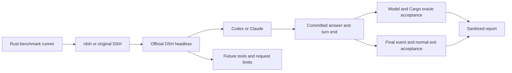

# Codex / Claude runtime benchmarks

The opt-in runner is Rust (`examples/benchmark_models.rs`). It delegates to the
installed official DSH headless profile through the real `rdsh` executable.
It does not implement an agent loop or invoke provider APIs independently.
CI runs only the offline acceptance and fence tests; it never uses model credentials.

The [2026-10-08 results](evidence/model-runtime-20261008.md) include failures and
separate model completion from normal headless shutdown.



## Run locally

Prerequisites: a clean committed checkout, Rust/Cargo, `zstd`, `shasum`, an
installed DSH with `headless --json`, and an existing authenticated credential
store. The provider catalog is a non-secret JSON object keyed by `openai-codex`
and `anthropic`, each with a `models` array. It must include `gpt-6.1-sol` and
`claude-sonnet-5-5`, including their official compatibility metadata.

```sh
cargo build --release --example benchmark_models --bin rdsh
cargo run --release --example benchmark_models -- \
  --bin ./target/release/rdsh \
  --original /absolute/path/to/original/dsh \
  --credentials /absolute/path/to/existing/.credentials.yaml \
  --catalog /absolute/path/to/non-secret/provider-catalog.json \
  --out /absolute/path/to/a/new/run-directory \
  --samples 3 --timeout-seconds 120
```

For the Desktop runtime, optionally add `--runtime-artifact` with its `app.asar`
path. The report fingerprints the Rust binary, original launcher and optional
runtime bundle with SHA-256, and records both versions and the source commit.
The live runner is verified on macOS; offline Rust tests also run in the repository's
Linux/macOS/Windows matrix. A new run directory is required each time.

Use `--only-case rust_fix` and optionally `--only-provider anthropic` for a
bounded follow-up. Follow-up results remain separate from the original benchmark.

## Conditions and acceptance

| Condition | Launcher | Independent acceptance |
| --- | --- | --- |
| Short arithmetic answer | Original DSH and rdsh | Exact nonce and sum, completed turn, exit 0 |
| Read synthetic JSON | rdsh | A successful file tool, hidden nonce and sum, unchanged fixture |
| Repair Rust range boundary | rdsh | Successful file tools, failed tests before repair, passed tests after repair for 1,001 inputs |

Both models use `high` reasoning effort. The stored request header verifies the
effort and advertised tools; session request contexts verify the selected route.
The Rust repair is deliberately bounded to inclusive-range or arithmetic-formula
implementations. Only four reviewed implementation shapes are executable by the
external Cargo oracle; arbitrary generated Rust is rejected before compilation.
This is a functional regression exercise, not a general coding-quality benchmark.

Each model has four conditions per sample: original response, rdsh response,
rdsh read and rdsh repair. Three samples mean **24 runs**, with a maximum of 48
agent request preparations. A read/repair run usually has several provider steps.
Request limits are 1/2/4 respectively; each run also has a process timeout.
The official provider retry limit is configured to zero, and retry-attempt events
make acceptance fail. Provider and response-launcher order alternate per sample;
runs are sequential and share an initially empty Node compile cache.

## Isolation and retained evidence

`HOME`, `DSH_HOME`, sessions and working files are dedicated to each run. The
model process starts with a cleared environment and an explicit path/locale/cache
allowlist. Its official credential provider receives only the existing store's
path; normal OAuth refresh may update that store. No credential values are
exported, copied into fixtures or included in the report. Existing profiles are
not edited.

The small `.mjs` fence is solely an adapter to the official Node tool registry.
It restricts advertised tools, applies a monotonic guard to existing canonical
fixture paths, and caps request preparations before the official model call.
The benchmark's fixtures, orchestration, subprocess control, acceptance,
statistics and reporting remain in Rust. Shell, web, delegation, plugins, skills,
telemetry and automatic LLM titles are disabled for these tests.

After route/usage extraction and oracle verification, the runner removes each
run's workspace, raw sessions, profile, patch, home and Cargo build output, also
on error. Only sanitized `result.json` and aggregate `report.json` are retained.
Model reasoning, raw tool payloads, error messages and stderr are not published.

## Reading the measurements

Response time runs from process spawn to the committed `turn_end`, including DSH
boot, network and model time. Process lifetime is also recorded separately.
If a completed turn does not exit within two seconds, the runner terminates its
own process group and records `shutdown_timeout`; runtime acceptance stays failed.
`model_passed` requires the exact committed answer, completed turn, tools and
independent oracle, route, effort, catalog and attempt checks. `passed` additionally
requires the official final event and a clean process exit. These are separate
results so a model response never hides a broken headless shutdown.
`first_committed_text_seconds` is a whole committed assistant message;
the official JSON projection does not expose first-token timing. Do not label it
TTFT or derive generation throughput from it.

Reports include all attempts and failures, successful nearest-rank p50/p95/max, tool count,
step count, recorded provider attempts, and per-step reported token usage. Cached
tokens remain separate where the provider supplies them. Three samples have a
p95 equal to the maximum, so this run does not establish stable tail latency,
model ranking or Rust launcher overhead amid network/model variability. Use the
local startup benchmark in [BENCHMARKS.md](BENCHMARKS.md) for launcher overhead.
The JSON field `median_success_seconds` is nearest-rank p50 (the lower middle
sample for an even successful sample count). Rust repairs additionally record
`generated_source_allowed` and `cargo_oracle_passed`; `null` means the Cargo
oracle was not executed, rather than passed.
