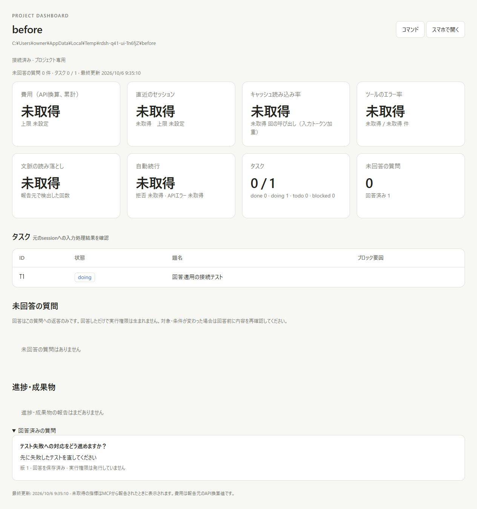
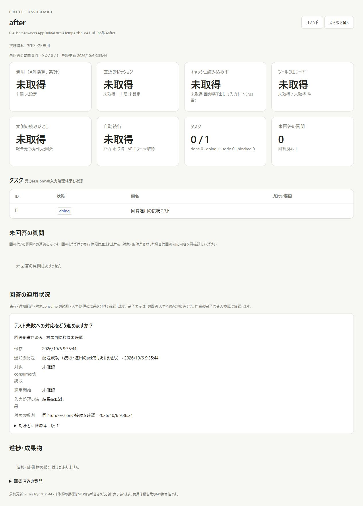
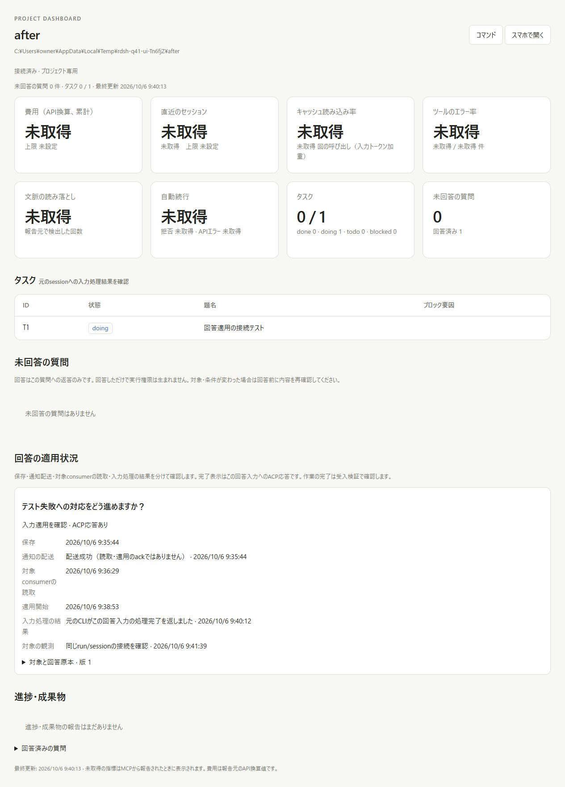
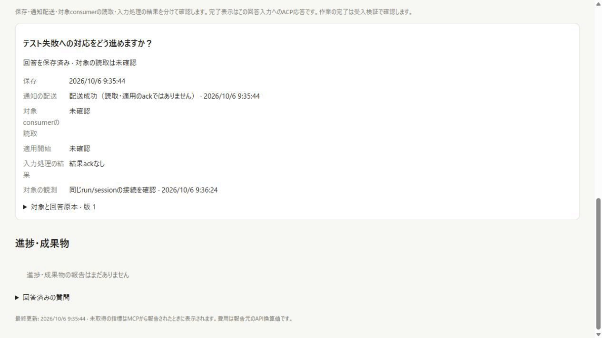
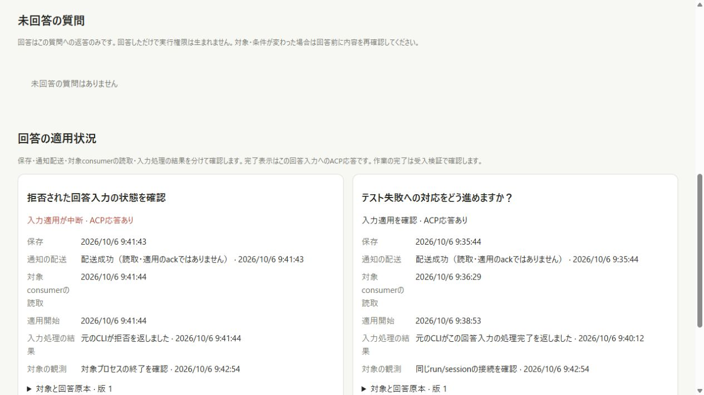
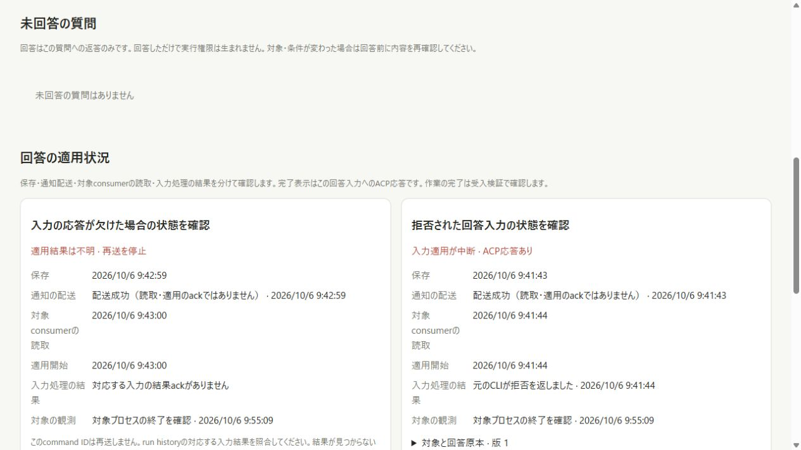
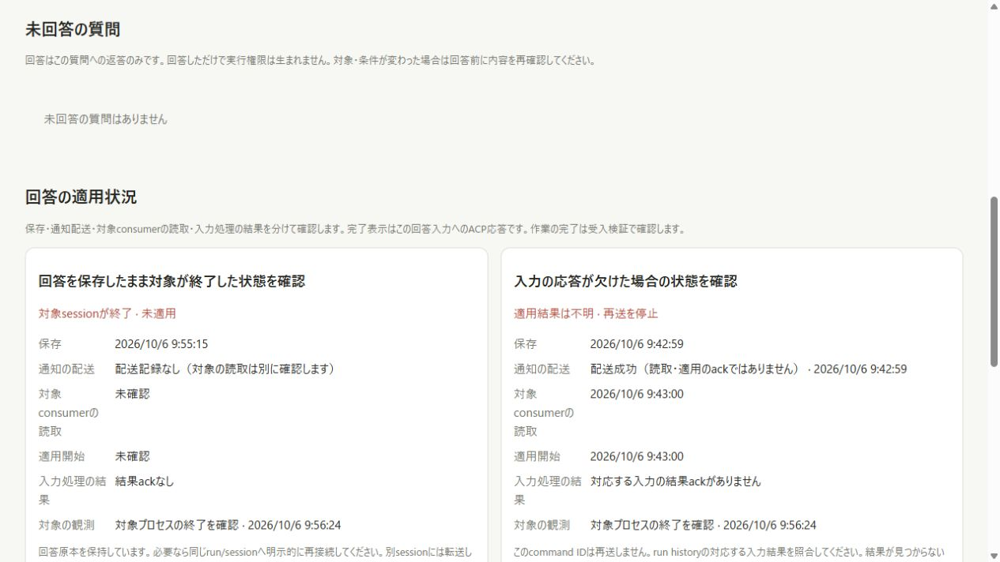
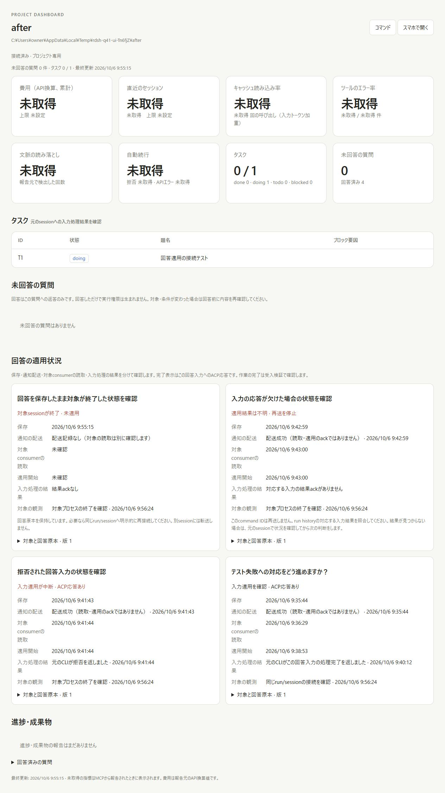

# Answer application verification

The change separates saved replies, notification delivery, target-consumer
reads, application claims and native input results. It adds an opt-in consumer
around the original ACP adapter and retains unbound feedback compatibility.

## Before and after

The baseline is commit `fc6cae9c91b84519f0ca483aa00ad610b576b18a` (#40). Its
actual dashboard can show the saved answer and question revision, but has no
consumer acknowledgement, input claim or correlated native result.

The changed dashboard was served by the real project server on Windows.
The first answer was entered and submitted through the browser UI. A signed
notification fixture succeeded while the card still showed that target read
and application were unconfirmed. Explicit consumer actions then advanced
read, claim and native input result independently.

The GIF contains four real viewport captures: saved/delivered, target read,
started, and native result. Frames are held for two seconds each for readability;
the eight-second playback is not a latency measurement. Full-page PNGs above
retain context that a viewport capture cannot show.

Separate real fixture processes exercised refusal, native result loss after
an effect, and target exit before a claim. Refusal stays failed; missing results
stay unknown; a saved answer with no claim remains unapplied after its target
ends. A successful historical result does not become another target's result.

The [DOM observations](answer-application/browser-observations.json) record the
visible stage text. The [runtime fixture](answer-application/runtime-fixture.json)
retains the actual public cards, immutable feedback, claims, input digests and
timestamps, excluding private runtime keys and filesystem roots. The final
fixture has three native prompt requests across four bound replies: completed,
refused, and response lost; the fourth target ended without a prompt request.

## Tests

Twelve new application tests cover:

- Saved-only/delivery-only states, non-consuming cursor GET, explicit read,
  claim and correlated result, with feedback unchanged after all stages.
- Concurrent readers, repeated begin attempts and old-cursor rereads with one
  observed native fixture effect and one prompt request.
- Consumer stop and explicit same-run/native-session resume, credential rotation,
  retained answer, and a second resume that never repeats a completed input.
- Effect followed by native response loss, plus explicit reconnect that stays
  unknown and leaves the fixture effect count at one.
- Dashboard restart with a missing application ack, recovering the existing
  native result without another send or native command.
- Lost begin response after commit, producing zero prompt effects and blocking
  replay of the existing claim.
- Different consumers/runs, project MCP/admin/browser credentials, forged success,
  wrong owners, unknown fields and hostile origins rejected without state changes.
- Changed revisions (including A to B to A), cancellation and expiry preserving original answers while
  preventing a new application claim.
- Native refusal represented as failed input processing.
- A matching native command ID with different input digest remaining unconfirmed.
- Corrupt, missing and unknown application schemas preserving the original file;
  legacy questions retaining their original field shapes.
- Public CLI `once` applying once across two explicit resumes, read-only inspection,
  and rejection of an entrypoint without its original executable.

An additional question-contract regression verifies that restoring the same
content at a newer revision never revalidates an old answer, including after
reopening the store.

Final dashboard tests passed on Windows (Node 22.23.3) and delegated Linux
(Node 24.21.0), **134/134** on each after a fresh `npm ci` and installation of
the same pinned Linux Koffi prebuilt used by the existing installer.
Release Rust tests passed **62/62**, release Clippy and formatting passed, and
the shell regression suite reported **ALL PASS (41 checks)**. Dependencies are
the existing pinned lockfile; no model/provider credential was required.

## Scope of the evidence

The peer is the instrumented ACP fixture launched as a real owned native
process; its effects are filesystem counters. No paid provider/model request,
remote Dot response or physical phone/Tailscale application was exercised.
The signed callback receiver is an injected test receiver, not a production Dot
endpoint. A recorded ACP result proves this input's processing result, not task
acceptance or completion of external effects. The behavior is described in
[the application contract](../ANSWER-APPLICATION.md).

All owned test consumers and servers were stopped and the temporary baseline
snapshot removed after capture. Unrelated workspace changes were preserved.
