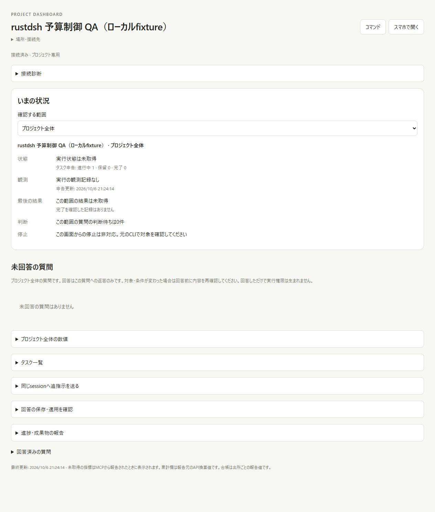
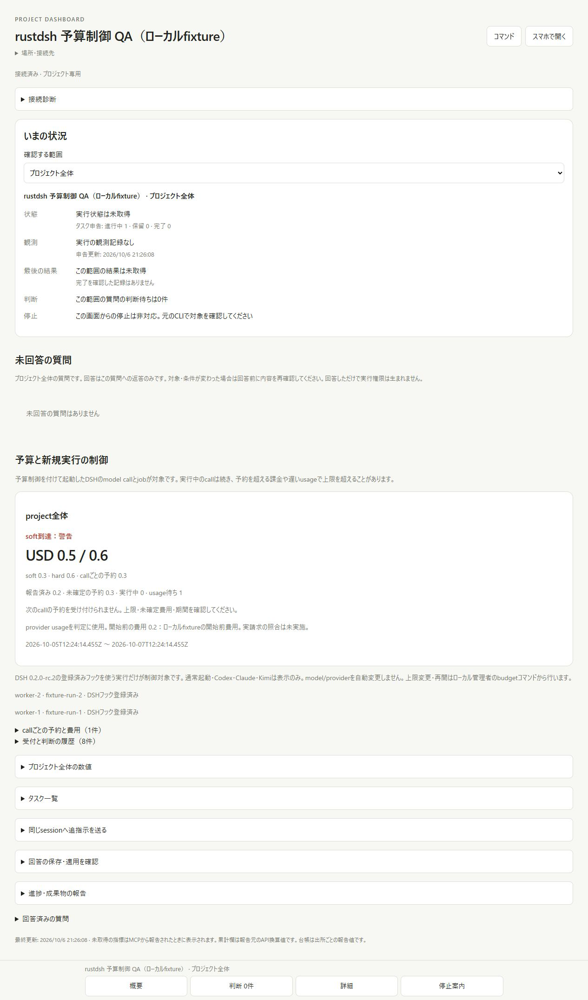
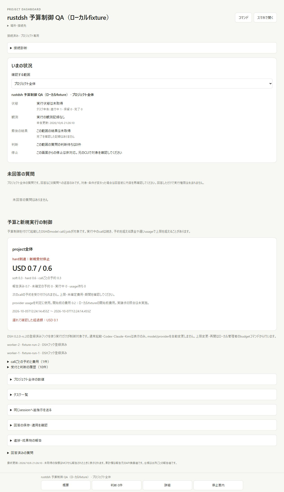
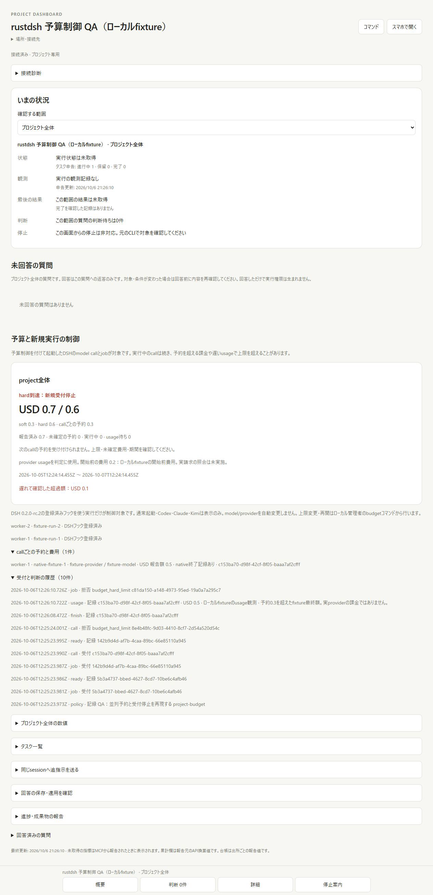
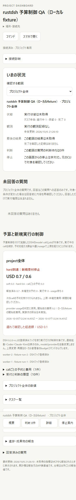
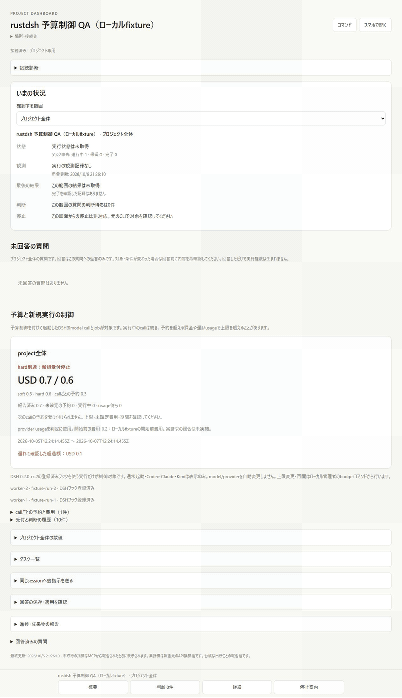

# Budget control evidence (#45)

Parent: `8fa6247066b5b21bf27eb6e0a9bd44a1089eeeaf` (cost-ledger PR #141).
The source before this change displays costs; it has no budget command or
model-call admission guard. These captures show the running project dashboard
with controlled local fixtures. They are actual browser captures, not mockups.

| Stage           | Actual capture                  | Observed behavior                                                              |
| --------------- | ------------------------------- | ------------------------------------------------------------------------------ |
| Before          |            | Budget control absent                                                          |
| Soft / running  |     | One of two workers admitted; reserved USD 0.3, executing 1                     |
| Awaiting usage  |  | Finished call retains USD 0.3; usage wait 1                                    |
| Hard / late fee |              | Opening USD 0.2 + final USD 0.5 = 0.7; hard 0.6, overspend 0.1; new job denied |
| Provenance      |    | Exact worker/session/model, receipt basis and admission/denial audit           |
| Mobile          |      | Viewport 390x844; document 375px wide with no horizontal overflow              |

[Capture manifest](capture-manifest.json) records pixel dimensions and GIF
frames. Browser bytes were converted to genuine PNG encoding without content
filters. The GIF scales the three real frames and adds white padding outside
them. [Mobile geometry](mobile-geometry.json) was measured in the live DOM;
the budget card was 347px wide (left 14, right 361). Physical phone and Tailscale
testing were not performed.

[Runtime observations](runtime-observations.json) preserve controlled-fixture
snapshots. [Output diff](output-diff.json) compares the actual parent CLI's
rejection of `budget inspect` with the new public CLI, the concurrent worker
result and denied new job. Final fee amounts are explicit local fixtures, not
real provider charges or verified invoices. No actual provider request was made.

[Native observations](native-observations.json) independently prove the installed
original DSH 0.2.0-rc.2 ACP session ID, native `--patch` activation/registration
and original Cordis/LlmRuntime waterfall with a local model adapter. Two
simultaneous workers permitted exactly one model dispatch. Late fixture usage
caused USD 0.1 overspend; two new model calls and a new job were denied. Original
provider/model stayed `fixture-provider` / `fixture-model`. The ACP bootstrap
sent no prompt. This proves hook/native startup behavior, not paid-provider auth,
current prices, invoices or full real-model agent execution.

Ten native local-adapter samples, including durable HTTP admission/finish and
local native chunks, measured median **6.08ms**, mean **7.01ms**, max **12.80ms**.
They exclude external final fee receipt and actual model latency. `receivedRoutes`
also includes these ten additional zero-cost timing calls after the admission
scenario; the permitted-dispatch count of one describes the concurrent scenario.
The complete
samples are in the native JSON; no UI performance claim is inferred from them.

Verification: Windows Node 22.23.3 (test concurrency 2) and Linux Node 24.21.0
each passed **169/169** tests. Windows's initial unrestricted concurrent run
ended with a child-process DLL initialization failure; it was not counted as
passing. The complete limited-concurrency run passed. After strict ID/calendar
validation, all eight budget tests passed again on both systems. Rust release
tests **62/62**, fmt, release clippy with warnings denied and regress **41/41**
passed. `npm ci --ignore-scripts` found zero vulnerabilities; package/lock files
were unchanged. Native scope/fixtures used isolated temporary directories and
were cleaned up; ordinary profiles and primary-worktree files were untouched.
