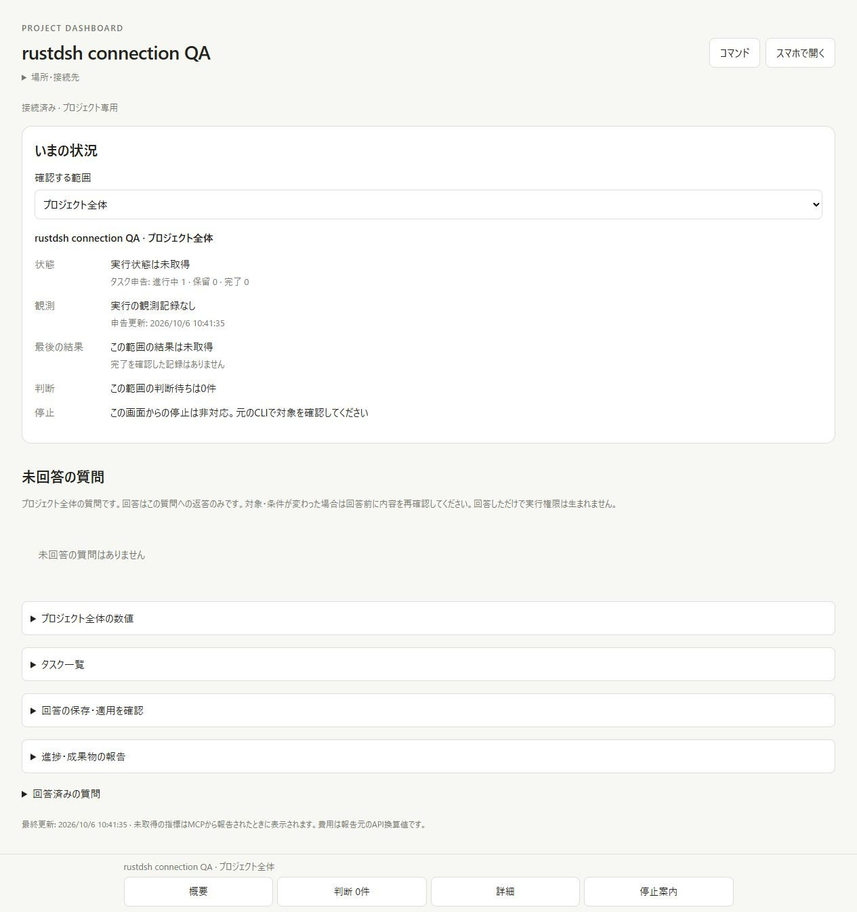
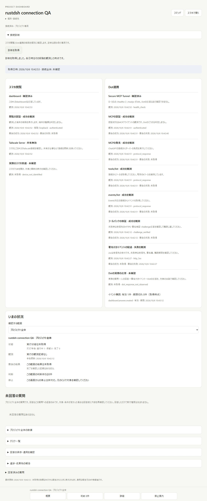
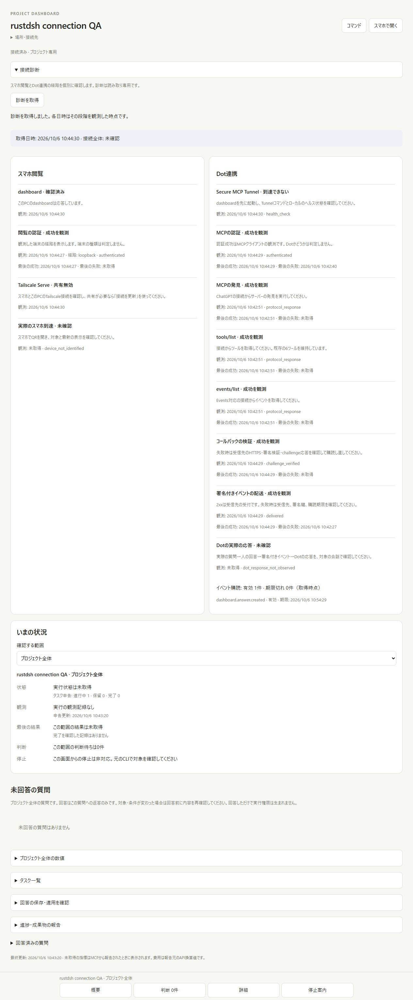
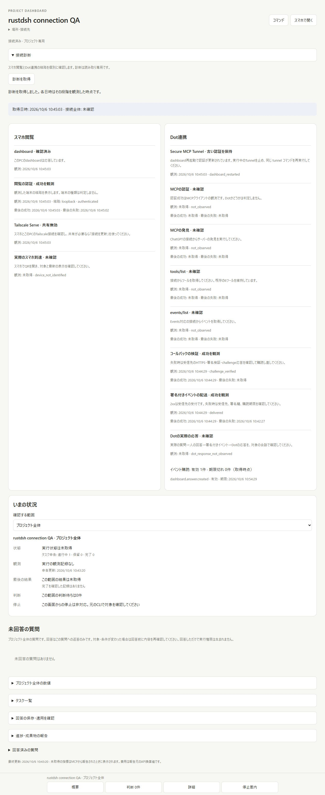
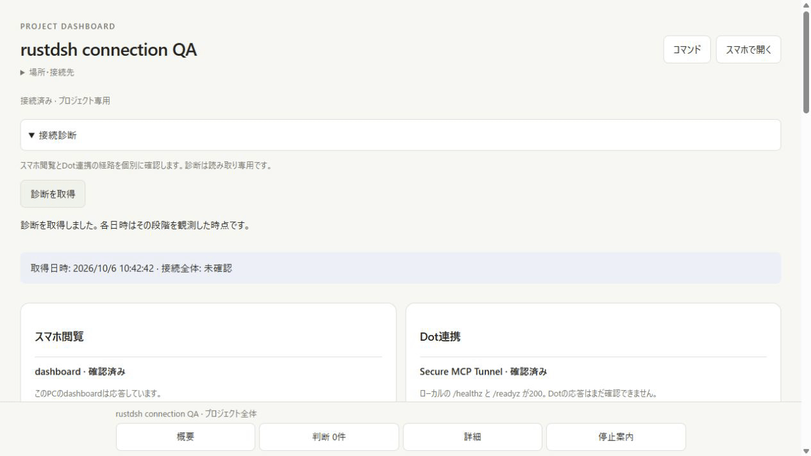

# Connection diagnostics technical verification

Baseline `b805a6a1642e629a677f26b3ecf34645ba4e96c5` (#42) offered an overall
browser connection label and a shared event count. The changed source adds a
read-only folded diagnosis with separate phone and Dot paths. Both versions
were served from their actual sources using owned temporary projects. These
are actual browser screenshots of local fixtures, not remote-service proof.
The [actual CLI output diff](connection-diagnostics/cli-output.diff) compares
the baseline's unsupported command with the current local diagnostic report.

## Independent failures and recovery

The actual UI showed browser authentication success alongside MCP bearer
rejection. A local HTTP health fixture responded successfully while the MCP
credential was rejected. Earlier successful discovery remains timestamped
separately from that newer authentication failure.

Authenticated MCP 2 requests discovered the server, six tools and five events.
A signed callback challenge was verified with Standard Webhooks. Its subsequent
answer delivery received `503`, correctly producing a delivery failure while
verification and discovery remained successful.

The fixture subscription expired during interactive capture. Renewing it and
restoring the receiver to `204` allowed the next durable answer event to be
received. Both success and prior failure timestamps remain visible. Closing
the local health listener independently made the Tunnel health unreachable;
the callback stage retained its successful receipt. These are different paths.

A real restart of the owned dashboard rotated its bearer and instance
generation. The still-live recorded fixture process retained the old
generation, producing `stale_credentials` with explicit Tunnel restart and
client reload guidance. In-memory MCP observations reverted to unconfirmed;
persisted callback observations retained their original timestamps. No bearer
or signing key was displayed.

The GIF holds four real viewport captures for two seconds each. Playback
duration is not a latency benchmark. This was a desktop browser check; no
physical-phone usability or Tailscale route was exercised. The initial card is
folded so existing project/task context stays visible.

[Runtime observations](connection-diagnostics/runtime-observations.json) retain
the local fixture stages and timestamps without keys, callback addresses or
private roots. Signed callback verification and HTTP delivery here used the
explicit local fixture injector; they were not requests to ChatGPT or Dot.
The recorded UI health process was the owned QA helper, not the official
Tunnel client. All owned servers and the temporary baseline were removed.

## Tests and remaining acceptance

Windows Node 22.23.3 and delegated Linux Node 24.21.0 each passed **142/142**
dashboard tests. Five new tests exercise actual local health HTTP responses,
generation/PID reuse gates, URL/redirect/project/size rejection, unknown process
identity, public diagnostics and stale credential rotation, read-only Serve
inspection, and the public Tunnel launcher's actual child lifecycle. That
launcher test substitutes an explicit local executable fixture and makes no
control-plane or provider request. Existing Events tests now verify successful
MCP discovery observations, callback failure/recovery persistence, expiry and
absence of keys/addresses from reports. The six-tool inventory is unchanged.

Rust formatting, release Clippy/build, **62/62** release tests and **41** shell
regression checks passed. `npm ci` completed with no vulnerabilities; no
dependency manifest or lockfile change was needed.

No provider request, actual Secure MCP Tunnel connection, remote Dot response,
physical phone or live Tailscale route was tested. The implementation keeps
overall end-to-end status unconfirmed; actual Dot response validation in #43
remains pending. This PR supplies implementation and technical QA and should
reference #43 without automatically closing it.
