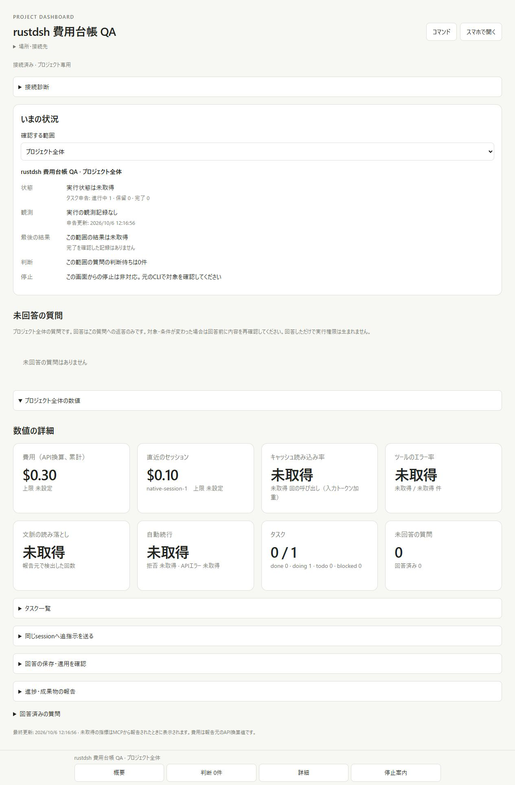
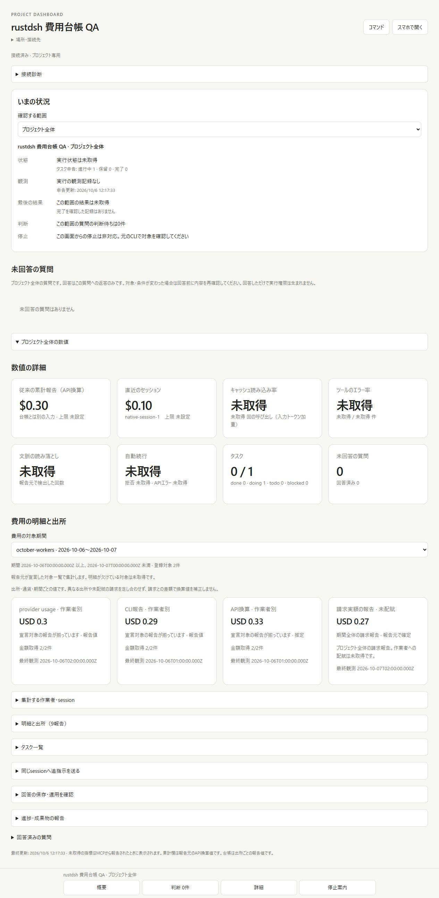
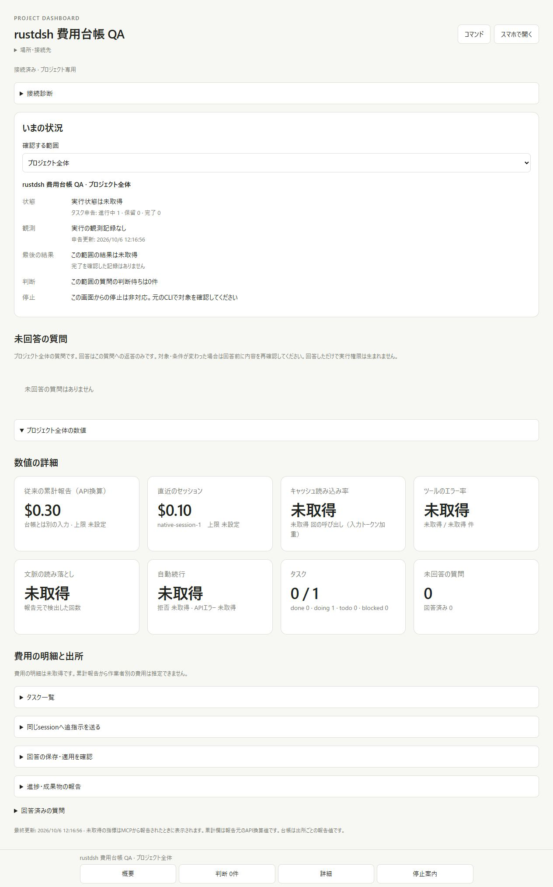
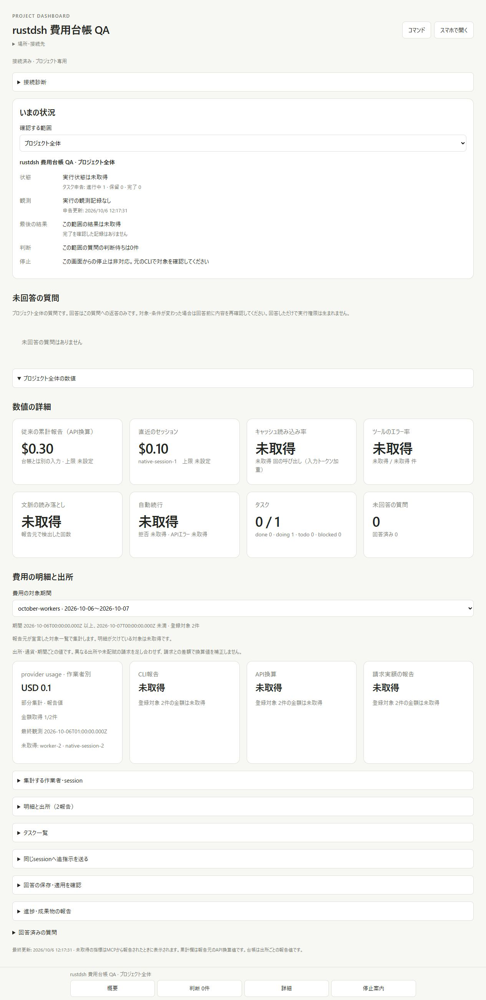
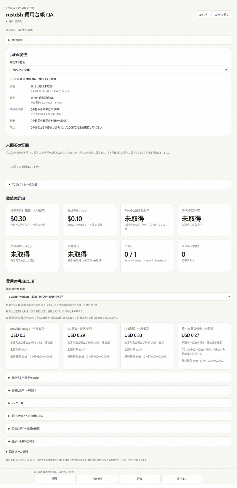
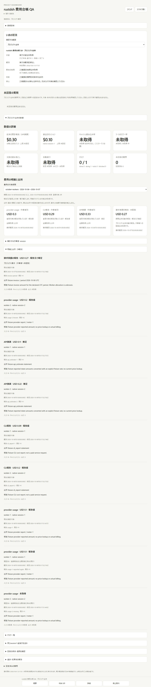
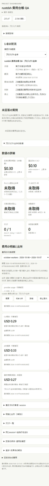

# Cost ledger validation evidence

These are real captures of isolated local project dashboards using explicitly
reported fixtures. No real provider request, billing authentication, current
price lookup or invoice verification occurred. The baseline is
`77b4f66b7fa65b24caedbb27491d7be037284b48` (PR #139).

## Before and after

The legacy amount remains USD 0.30. Two worker reports produce provider usage
USD 0.30, CLI reports USD 0.29 and API estimates USD 0.33. The fixture invoice is
USD 0.27, shown as an unallocated project invoice with its own source reference
and period. It does not change the other amounts or become per-worker spend.

## Unknown and partial reporting

Worker two initially has an unknown amount and unknown tokens. The known worker
one subtotal remains USD 0.10 with **部分集計**, coverage 1/2 and the missing
worker/session named. A later cumulative observation fills worker two's amount;
the earlier unknown observation remains in history. A repeated worker one meter
observation remains a history alias and is not added again.

## Provenance and phone-sized layout

[Measured browser geometry](mobile-geometry.json) confirms viewport 390×844,
document client/scroll width 375/375 (15 pixels for the scrollbar), 347-pixel
cards/select and a 44-pixel select height. Cards use one column at this width.
This is a browser viewport test; physical phone and Tailscale were not tested.

The browser returned JPEG screenshot bytes; PNGs are direct encoding conversions
without content filters. The GIF uses the three actual empty/partial/after
captures, scales to 800 pixels and adds white padding outside original frames.
No UI content is generated or composited. Dimensions and frame order are recorded
in the [capture manifest](capture-manifest.json).

## Output difference and checks

[Actual public CLI output difference](output-diff.json): the baseline rejects
`cost-ledger`; the new CLI accepts a same-ID report retry and returns the durable
per-source ledger. Provider usage remains USD 0.30, API estimate USD 0.33 and
unallocated invoice USD 0.27 after that retry.
[Recorded public state observations](runtime-observations.json) retain the
partial, filled and CLI-retry states, exact periods, identities, references,
receipt times, inclusion flags and aggregate coverage. No credentials are stored.

- Dashboard tests: Windows Node 22.23.3 **161/161**, 151,272.8122 ms;
  Linux Node 24.21.0 in a delegated systemd scope **161/161**, 62,760.702908 ms.
- Eight cost-specific tests cover duplicate IDs and native observation sequences,
  decimal arithmetic, two-worker sums, out-of-order and decreasing meters,
  event/cumulative mixing, distinct source/currency amounts, missing coverage,
  corrupt persistence, six-tool MCP compatibility, parallel HTTP reports, lost
  response retry, the real public CLI and browser read-only permissions.
- Rust format, release clippy with warnings denied, **62** release tests,
  release build and **41** CLI regression checks pass.
- `npm ci`: 139 packages, zero reported vulnerabilities; package/lock unchanged.

These checks establish the implemented reporting, aggregation and display
contracts. They do not verify real provider prices, real billing statements,
native worker attachment or hard budget enforcement. See the
[ledger contract](../../COST-LEDGER.md); budget admission is issue #45.
