# Mobile overview technical verification

Baseline `a09688725fc5f4a5fa9f3f48c2a0fbc4e479242e` (#41) shows the metric grid
before tasks and questions. The changed working tree puts project/task scope,
state/evidence time, last result, decisions and truthful stop guidance first.
Both versions were served from their actual sources with owned temporary
projects. Screenshots are real browser captures.

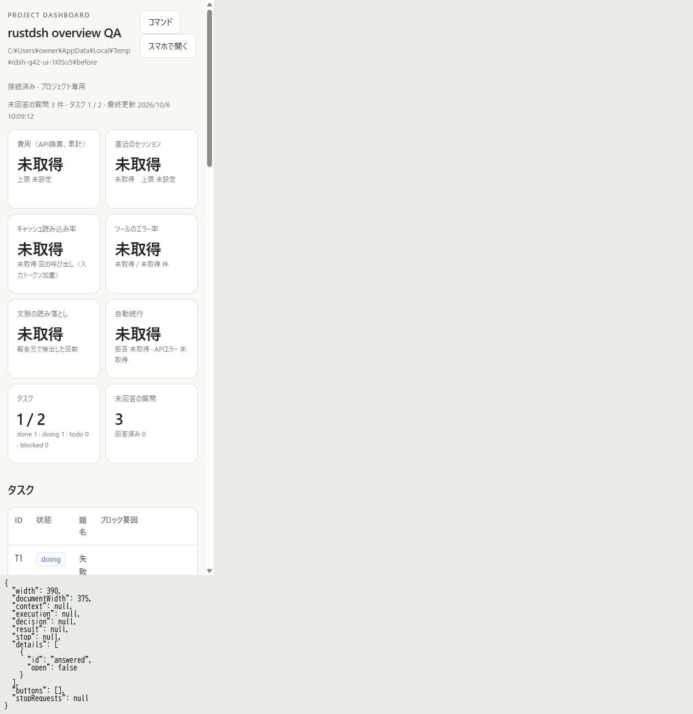
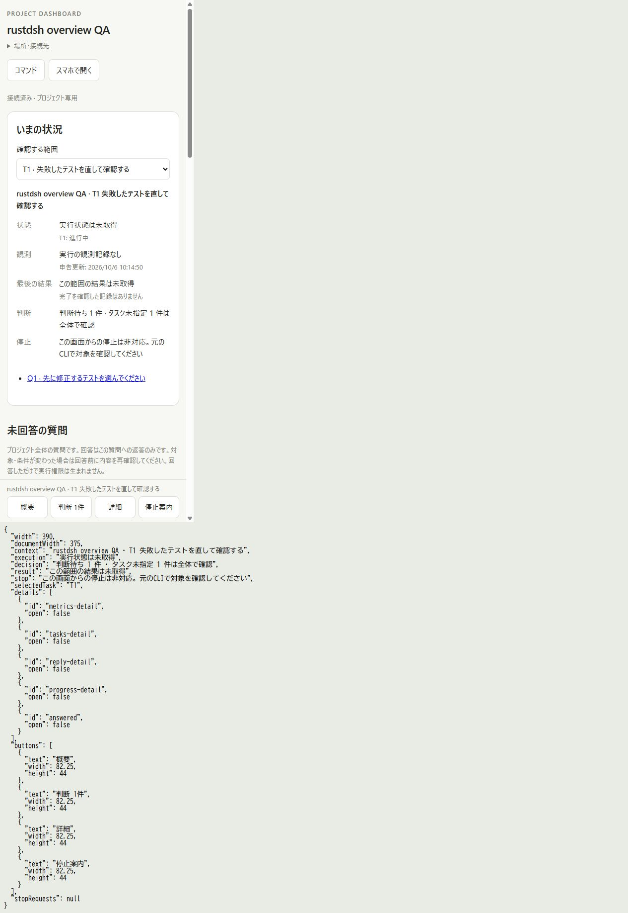
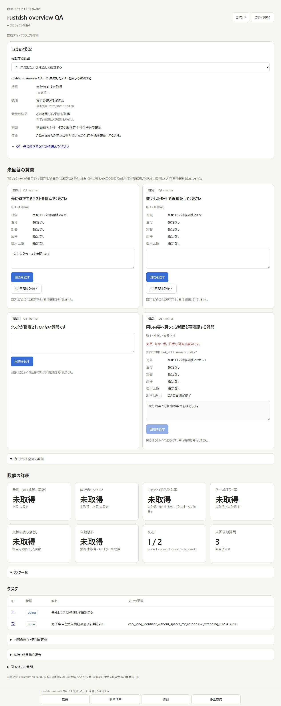

## Responsive layout and context

The actual UI was embedded in a same-origin QA iframe. A separate DOM-only
measurement panel records the iframe viewport and document width without
changing the dashboard source. It is not a physical-phone test.

| Viewport | Document width | Bottom button minimum height |
| -------- | -------------- | ---------------------------- |
| 320px    | 305px          | 58.78px                      |
| 390px    | 375px          | 44px                         |
| 430px    | 415px          | 44px                         |

The 15px difference is the scroll gutter. Main information did not require
horizontal scrolling at these widths. The 320px navigation wrapped text while
preserving button height. The views included missing state/result, multiple
decisions, zero decisions, unbound questions, and an explicitly missing task.

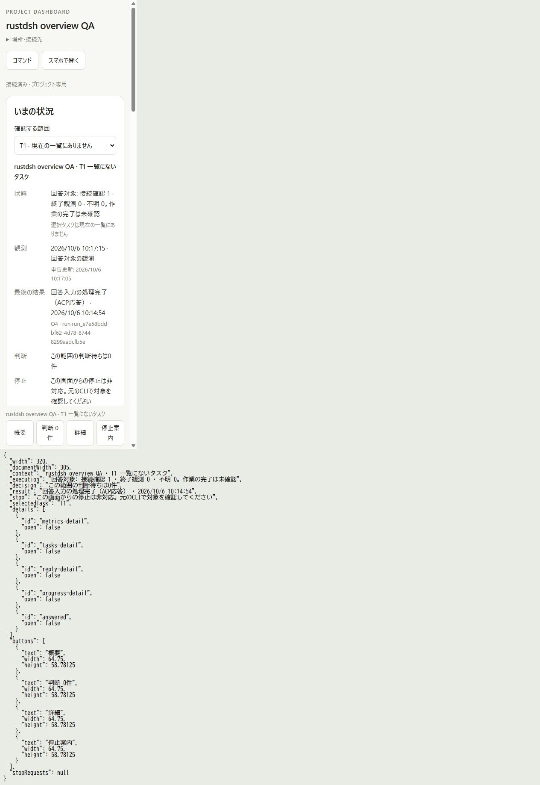
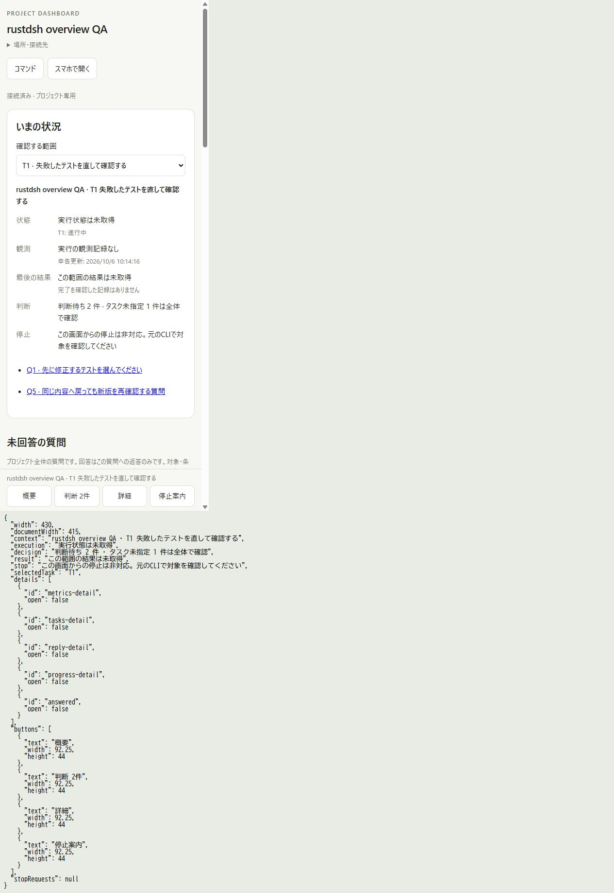
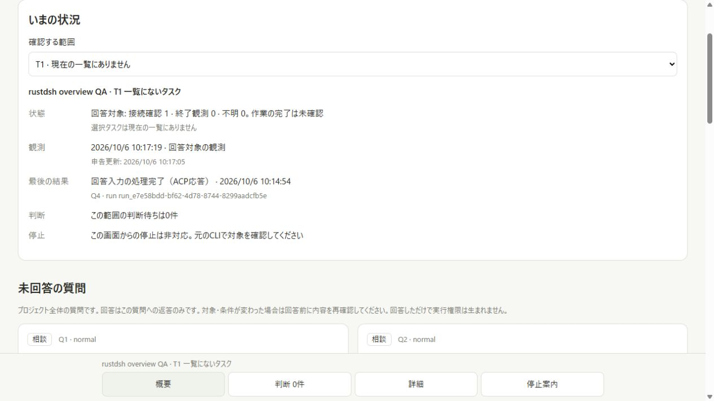

In the desktop browser, opening T1's task ID, opening metric details and an
unrelated SSE update retained T1 and the draft `先に失敗ケースを確認します`.
Task deep-link reload was also checked. Detail navigation opens the appropriate
fold and focuses its heading. The GIF uses four real viewport captures held
for two seconds each; its playback length is not an interaction benchmark.

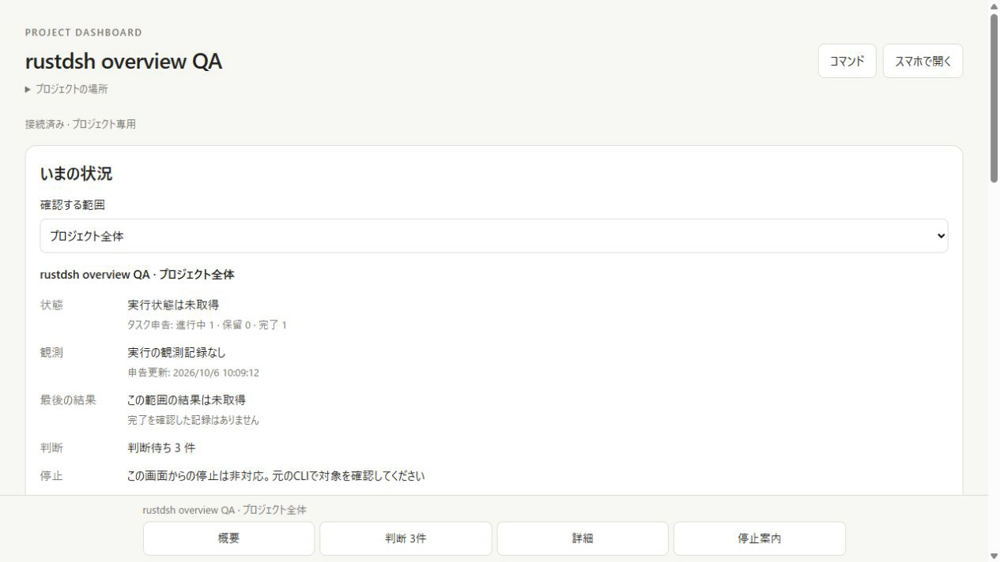

A separate typed question was revised A to B to A (revision 1 to 3, identical
final content fingerprint). A fresh browser running the corrected renderer kept
the draft but left review unchecked and submission disabled. The persisted
contract regression also checks this same revision guard.

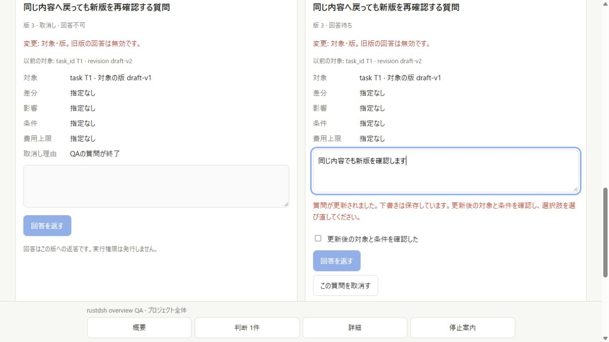

## Native results and stop confirmation

An actual owned ACP fixture processed one reply, producing one prompt request
and one fixture effect. Its correlated input response appears as an ACP result,
with task completion still unconfirmed and pending decisions at zero.

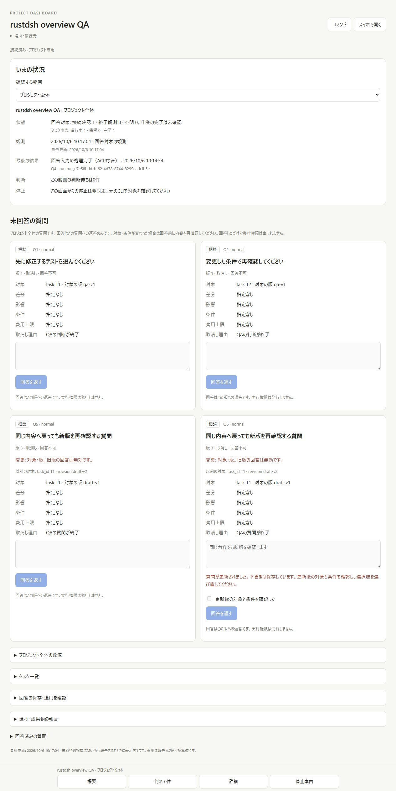

A separate native Harness fixture owned its root and descendants. Cancel and a
simulated changed-target GET produced zero stop HTTP requests, with five owned
processes still observed. Returning to the actual target and confirming sent
one request; its ownership scope subsequently confirmed zero remaining processes.
The changed-target GET was an injected diagnostic fixture, not another real run.

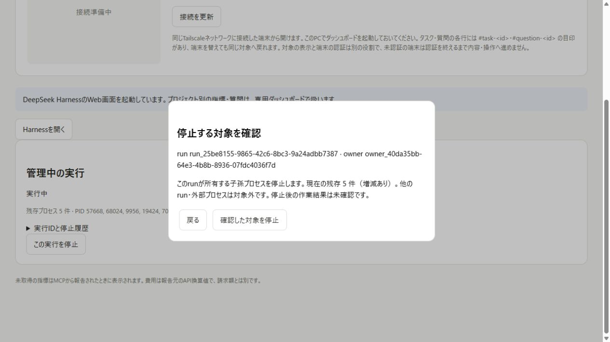
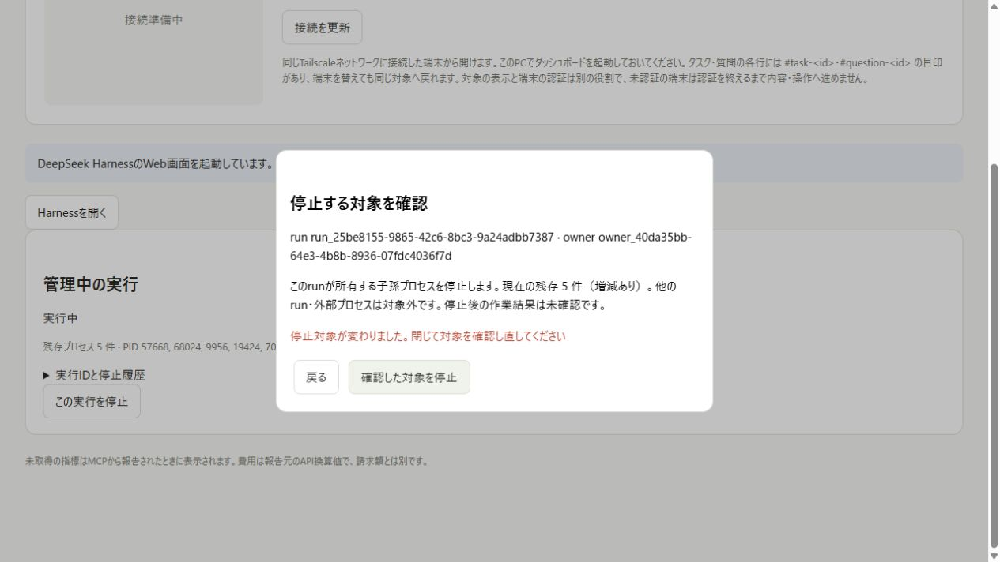
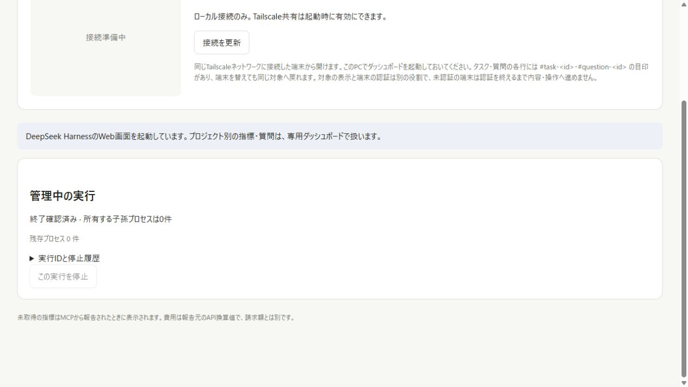

[DOM observations](mobile-overview/browser-observations.json) and
[native runtime observations](mobile-overview/runtime-observations.json) retain
the measured values without runtime keys or private filesystem roots.
All owned consumers, native descendants, servers and temporary baseline files
were cleaned up after capture. The user's unrelated workspace files remain intact.

## Verification and remaining acceptance

Final Windows Node 22.23.3 and delegated Linux Node 24.21.0 dashboard suites each
passed **137/137**. Three new overview tests check missing state, task-scoped
decisions/results and refusal to reuse older success. The existing real
question-revision persistence test now also checks the draft/review guard.
Rust formatting, release Clippy/build, **62/62** release tests and **41** shell
regression checks passed. No dependency or lockfile changes were needed.

No provider/model request, physical phone, remote Dot or Tailscale route was
tested. The human participant scenario and approximately 30-second comprehension
target in issue #42 remain untested. This is technical QA and implementation
evidence, not completion of that usability acceptance condition. The PR should
reference #42 without automatically closing it.
