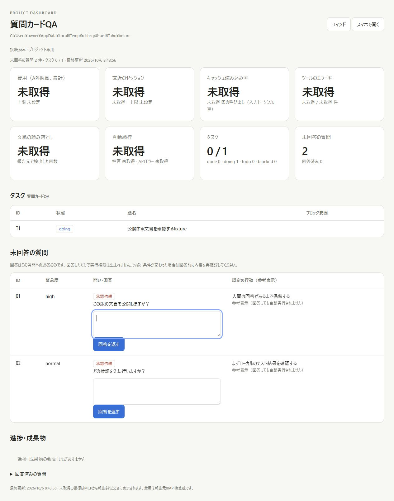
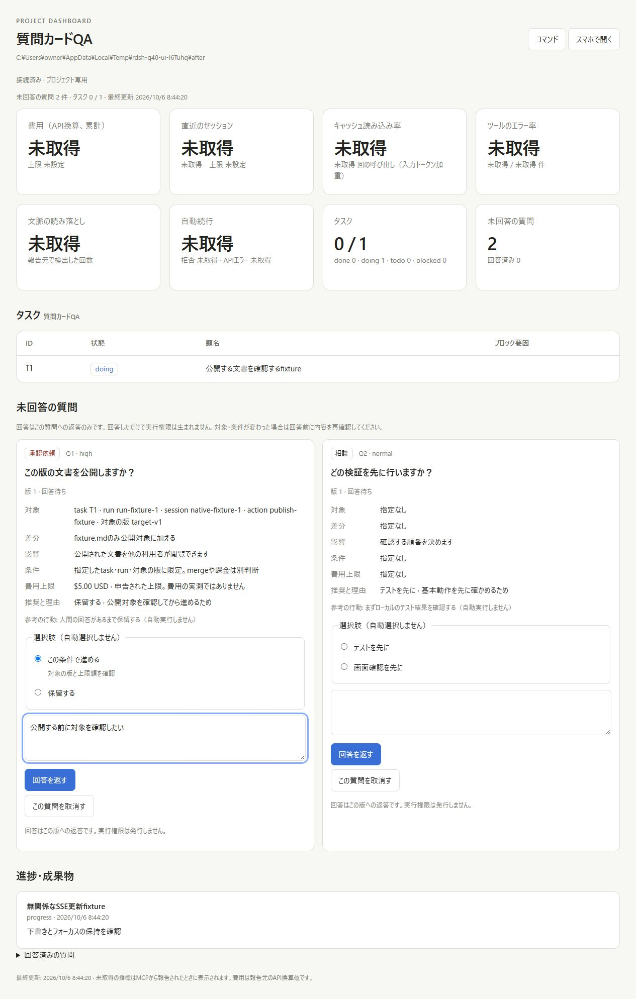
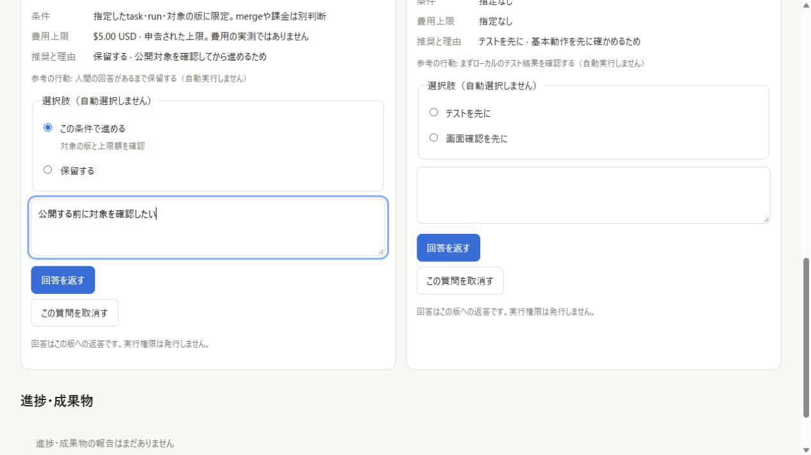
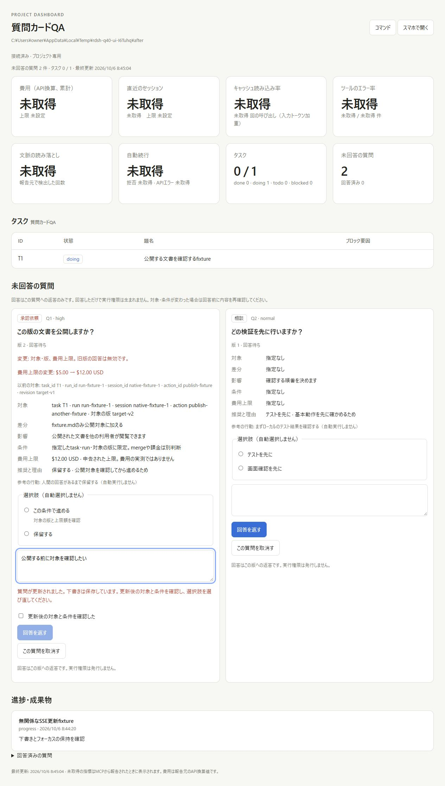
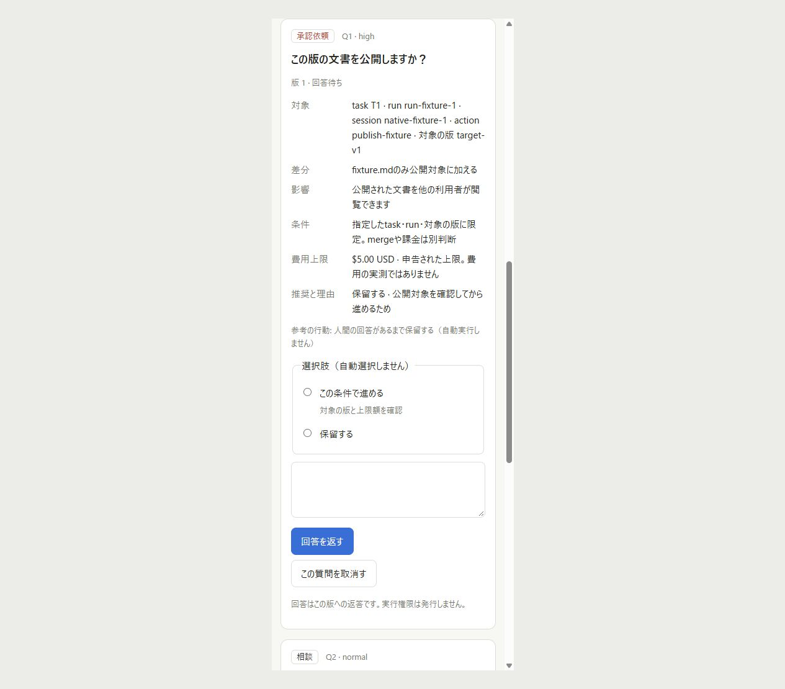
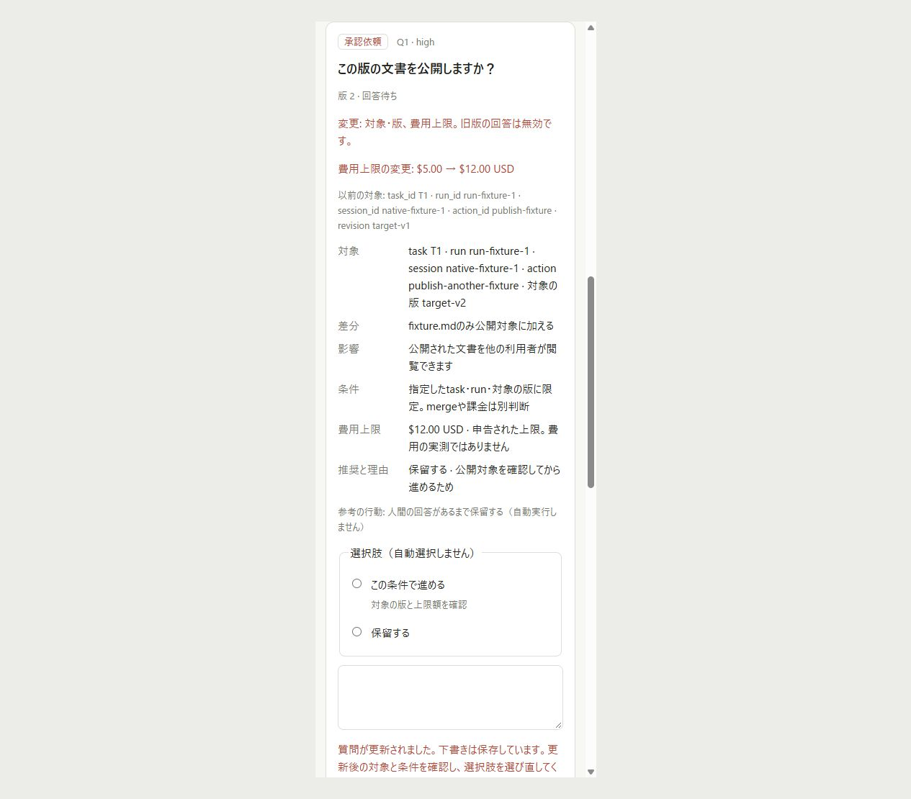
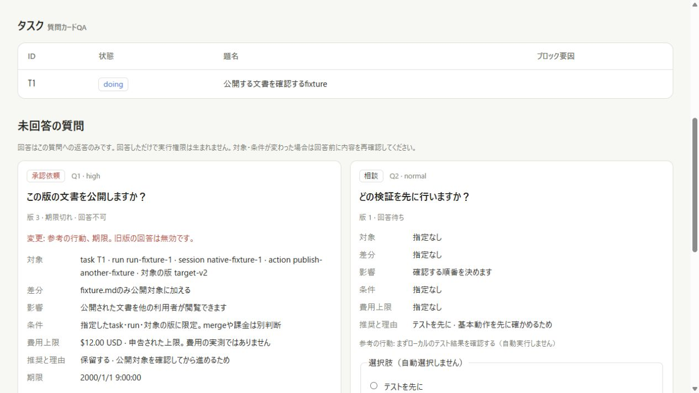
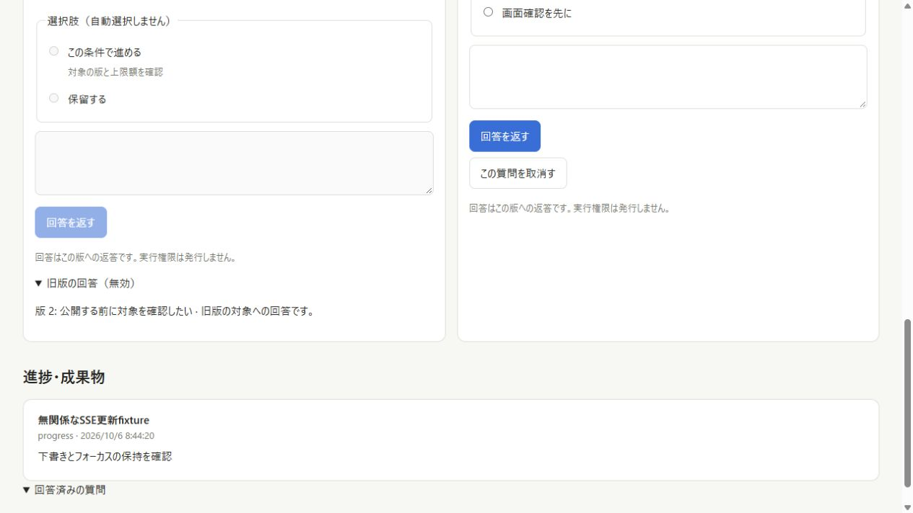

# Question card evidence

Baseline: commit `55e68cb` (the scoped-stop branch), whose dashboard displays
legacy free-text questions and infers an approval badge from `default_action`.
The new dashboard uses explicit consultation/approval contracts and preserves
legacy questions as consultations. Both screens were served from their actual
source directories with temporary projects and fixture questions; no real
publication, billing, model request or native agent operation was performed.

## Observed behavior

| Situation                                           | Before                                    | After                                                |
| --------------------------------------------------- | ----------------------------------------- | ---------------------------------------------------- |
| Reference/default action on a consultation          | Inferred approval badge                   | Consultation; no execution authority                 |
| Choices, target revision, diff, cost and impact     | Free text only                            | Structured context in the same card                  |
| Action or cost changed while drafting               | No versioned question contract            | New revision; old selection cleared; review required |
| Saved answer to a superseded revision               | No target binding                         | Original retained; validity becomes invalidated      |
| Answered content A changed to B, then restored to A | Older revision could appear current again | Revision and fingerprint must both match             |
| Expiry or cancellation                              | No typed lifecycle                        | Disabled response; HTTP 409 on stale submission      |
| Unrelated SSE update                                | Draft/focus preserved                     | Draft, choice, focus and selection preserved         |

The actual browser observation in
[browser-observations.json](question-contracts/browser-observations.json)
shows a draft of `公開する前に対象を確認したい`, textarea selection `[14,14]`, and
selected `proceed` after an unrelated SSE event. Changing action/revision and
the declared cost from USD 5 to USD 12 retained the draft/focus/selection,
cleared the radio selection, left the review checkbox unchecked and disabled
submission. Reviewing the new conditions and selecting `hold` then allowed
the actual human browser to save a reply to revision 2. The UI called it saved,
without claiming execution authority or application by a consumer.

Revision 3 expired and was subsequently cancelled. The revision-2 answer stayed
in the original feedback and appeared in the visible invalidated-answer history.
The [server observation](question-contracts/revision-fixture.json) includes
the retained answer, target revision and invalidation reason without runtime
credentials, private project paths or environment values.

The follow-up [before/after output](question-contracts/restored-revision.json)
calls the original `fc6cae9` and corrected validity functions with the same
synthetic view input: revision 3 has restored revision 1's content. The old
answer now stays invalidated while the revision-3 answer remains current.
The persistence regression also creates, revises and answers real typed cards,
then reopens the store to verify that the original answer remains unchanged.

## Real PNG captures and GIF

These are unmodified screenshots captured through the Codex browser. The GIF
exports four actual desktop captures (draft, changed conditions, reviewed
conditions, saved answer). Its eight-second playback illustrates the steps;
it does not measure request latency. The 390px images render the actual project
UI in a same-origin responsive iframe; they are not proof of a physical phone
or Tailscale transport. Desktop interactions and human HTTP boundaries were
tested separately.

## Validation

Windows Node 22.23.3 and WSL/Linux Node 24.21.0 each passed all **122** dashboard
tests, including seven new contract/HTTP tests. They cover legacy compatibility,
typed persistence, action/cost revision races, original feedback retention,
stale fingerprint rejection, restored content at a new revision, cancellation/expiry, malformed metadata preserved
on disk, MCP/admin answer rejection, host/origin rejection and simultaneous human
answers producing one feedback record. HTTP and stdio MCP retain six tools.

`cargo fmt --check`, release Clippy over all targets with warnings denied,
release build, **62** Rust tests and **41** regression checks passed. Markdown
validation passed over **38** tracked/new Markdown files. Test projects and
servers used private temporary directories and were removed after capture.
