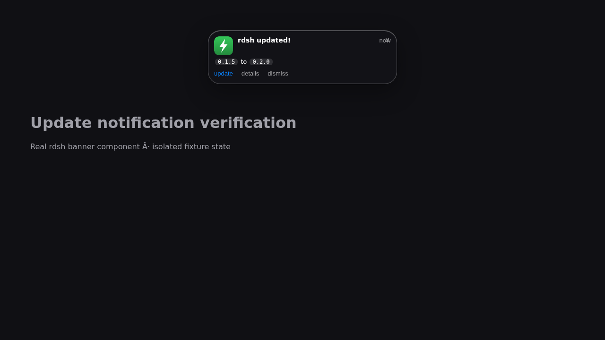
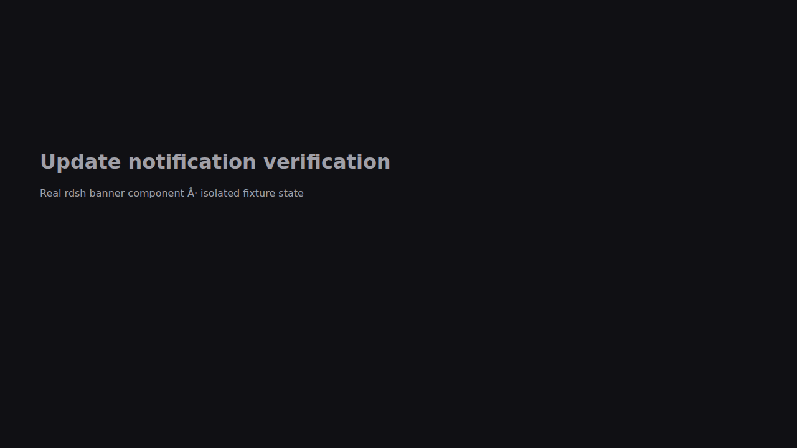

# Update banner evidence — 2026-10-08

Real Chromium screenshots of the unchanged React banner component source,
mounted through a minimal slot host with an isolated, synthetic update endpoint.
This verifies client behavior; it is not a live DSH GUI authentication test.

- Before source: `origin/main` at `1fdec5f`; dismiss stays hidden during polling
  but the same update reappears after a page reload.
- After source: the release branch client; dismiss remains hidden during the
  next 60-second poll and after reload, with the update key saved in localStorage.
- Playwright browser clock advances the polling interval; the update fixture is
  `0.1.5 → 0.2.0`. No model, user profile or real update is used.
- GIF frames are actual captures of the new visible banner and the dismissed,
  reloaded state. They show state transitions, not a continuous screen recording.

