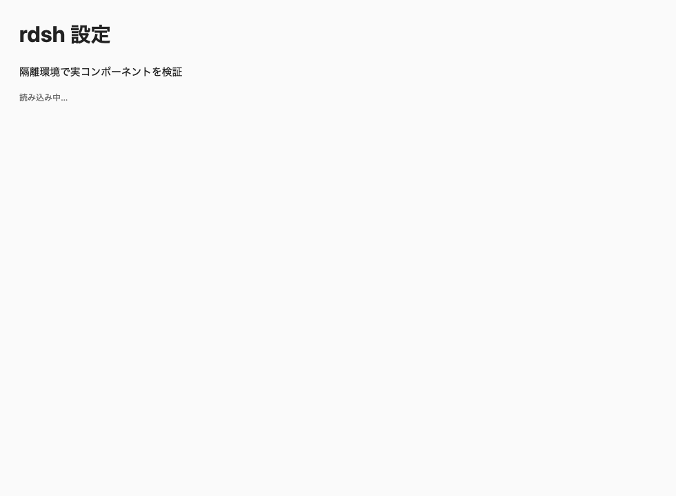
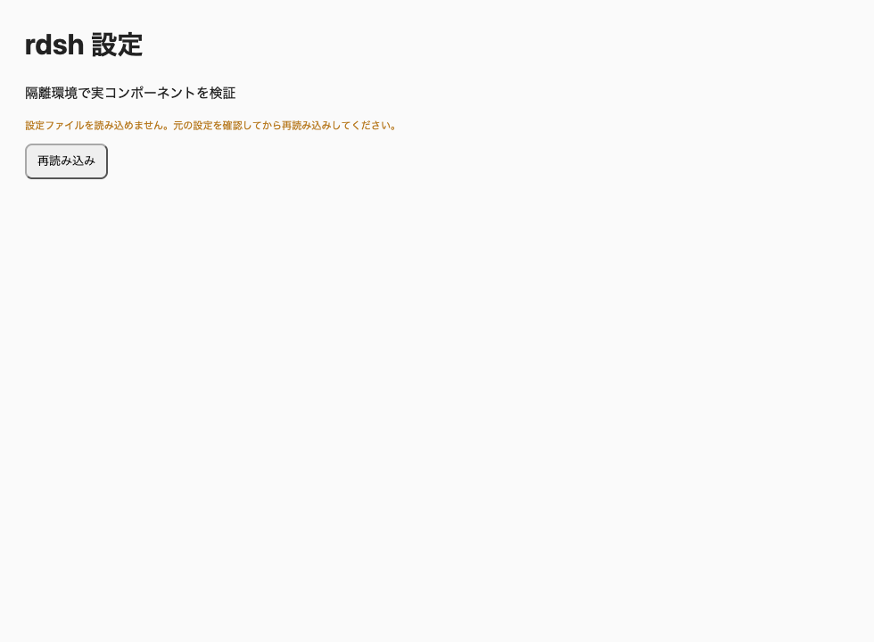
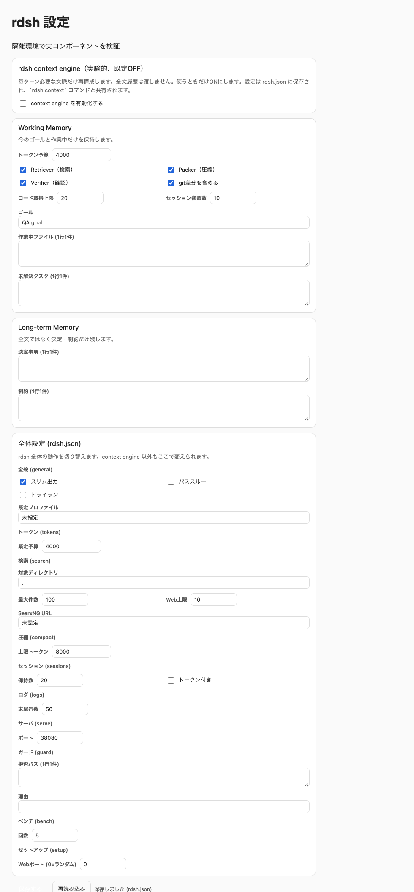
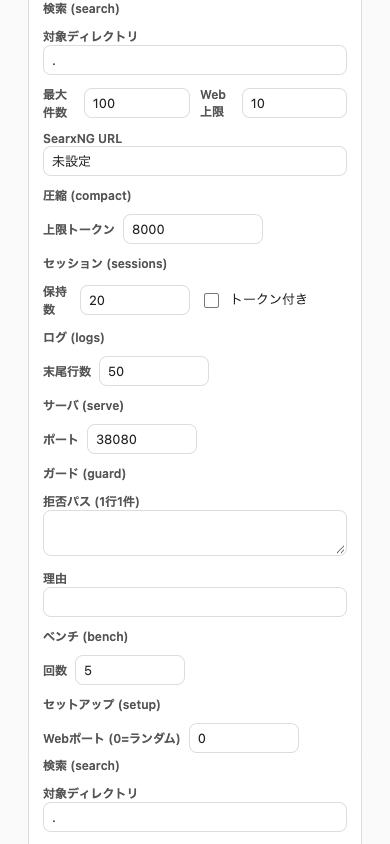

# Settings recovery and UI flow verification, 2026-10-08

## Changes verified

The CLI explicitly resets corrupt settings with `settings init --force` while
ordinary commands preserve the original document and return an error. Existing
non-object JSON is also rejected. A missing document still uses defaults.

The settings API reports invalid documents instead of returning successful defaults.
The client shows an error with a retry button, discards a stale form after failed
refresh, and checks HTTP success before accepting data or reporting a save.
Server defaults, client fallback, and doctor guidance agree on port 38080.
Clearing the port input also preserves that default.

## Browser checks

| Check | Result |
| --- | --- |
| Page identity / meaningful content | Passed |
| Framework error overlay / JavaScript page errors | None |
| Failure handling | Error and retry displayed; saving unavailable |
| Interaction | Repair fixture, retry, edit goal, save, independently read saved file |
| Saved port | 38080, including a cleared port input |
| Viewports | 980 × 720 and 390 × 844 |

Browser plugin was not available; bundled Playwright drove installed Chrome in a
separate temporary browser profile. These are real captures of the existing React
component and settings API mounted in an isolated test host. The before/after
component receives the same API error. The fixture host supplies the module-loader,
theme, and an authenticated connection stub; authentication rejection and side-effect
boundaries are checked separately by the plugin security tests.
This does not establish full DSH/Desktop integration, model authentication, or phone
access. HTTP 400 during the deliberately corrupt fixture is an expected response.

## Screenshots

Before: the component remains loading after an API error.

After: error is actionable and the form cannot save stale data.

After retry, edit, and save; file readback verifies goal and port.

Mobile first viewport after the same successful save.

