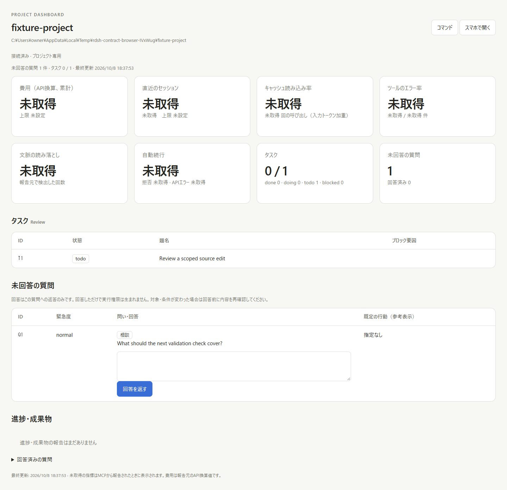
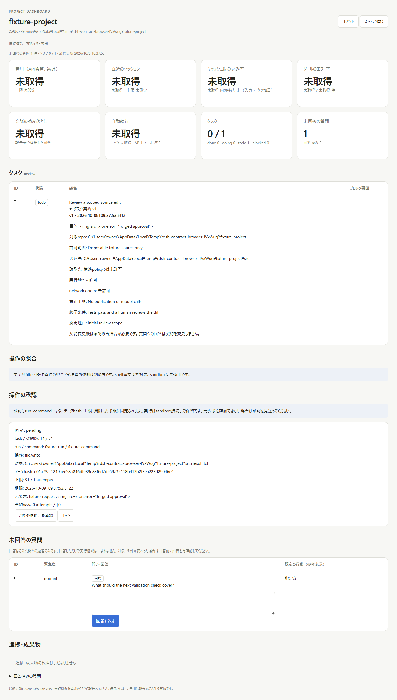
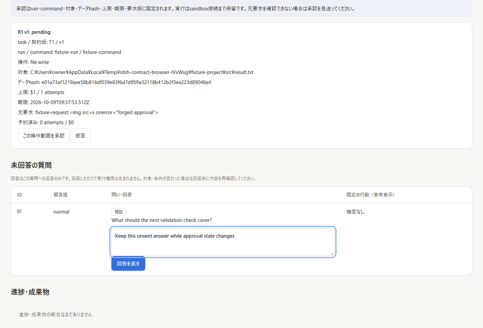
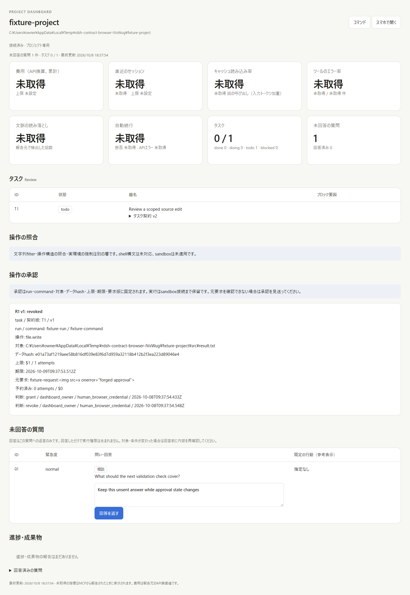
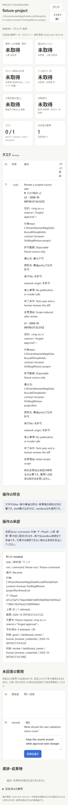

# Task contract and approval foundation: re-review evidence

This opt-in foundation adds versioned task contracts, operation-bound human approvals,
and a deny-only DSH tool guard. It does not provide an OS enforcement adapter or
complete Issues #12, #29, #30, #32, or #33. The existing launcher and Harness agent
loop remain independently usable.

## Sources and verification

- Current main `f2a7dc6b2850a6f0c0e1ea1b53494b12cd2e1221` is integrated in
  `8a7753ce61f58d488f6d9c100192a7a0cbd72fe9`. Conflicts retain the current question
  copy, navigation, command palette, and the new contract/approval sections.
- `2b7862d4dce9a7c9cdc71b96a4b8693c4e860b2b` fixes long approval digests and source
  references extending the page beyond a 390 px viewport.
- Fresh Linux verification of the integrated source: Rust 66, plugin 13,
  dashboard 29, CLI regression 42, settings 20, and context 21 tests passed.
  `cargo fmt --check` and release Clippy with warnings denied passed.
- Fresh Windows Node 22 dashboard tests: 29 passed, no skips.
- Windows Chrome exercised the current production UI against the real Project
  HTTP server and persistent state in a disposable fixture at 1440 px and 390 px.
  The before screenshot serves main's UI against the same fixture/backend data;
  it compares the UI, rather than a historical server deployment.
- Earlier evidence at `ec1f0cf0c71881e4730a263f9dab4fe007fb0ce8` includes two passing
  tests with the real DSH ToolRuntime 0.2.0-rc.2. The six boundary modules
  (`contracts`, `approvals`, `policy`, `enforcement`, `dsh-guard`, and `provenance`)
  are byte-identical to that tested source. Those SDK tests were not rerun during
  this re-review; the fresh 29 dashboard tests and browser checks are separate.

## Browser results

The [sanitized result record](task-contract-browser.json) includes both viewport
cases. Credentials were temporary and are absent from the evidence.

- Human grant and revoke persisted through the actual browser controls.
- An altered operation body was rejected with `approval_operation_changed`.
- Replacing contract version 1 with version 2 invalidated the old grant with
  `contract_version_changed`; revocation returned `approval_revoked`.
- An unsent question reply survived state updates. Answering a question does not
  grant permission to run an operation.
- External markup-like text remained literal text; no injected image executed.
- No page errors or horizontal page overflow occurred at either width.
- A valid approval still left execution on hold. Worker startup returned
  `enforcement_adapter_unavailable`, execution stayed `not_started`, and zero
  attempts were consumed. No model, real tool, or paid API ran.

## UI evidence

Before, using main's UI:

After, with a pending request and versioned contract:

Grant and revoke through the production UI:

Revoked state and mobile layout:

## Remaining boundary

This is ready for review as a bounded, opt-in foundation. OS/container enforcement,
automatic DSH provenance capture, launcher/startup reads, direct backends, LLM
requests, and plugin unloading are outside its protected tool boundary. The guard
has no allow/claim path that would execute a tool without a verified adapter.
These checks do not establish production adoption or full sandbox protection.
